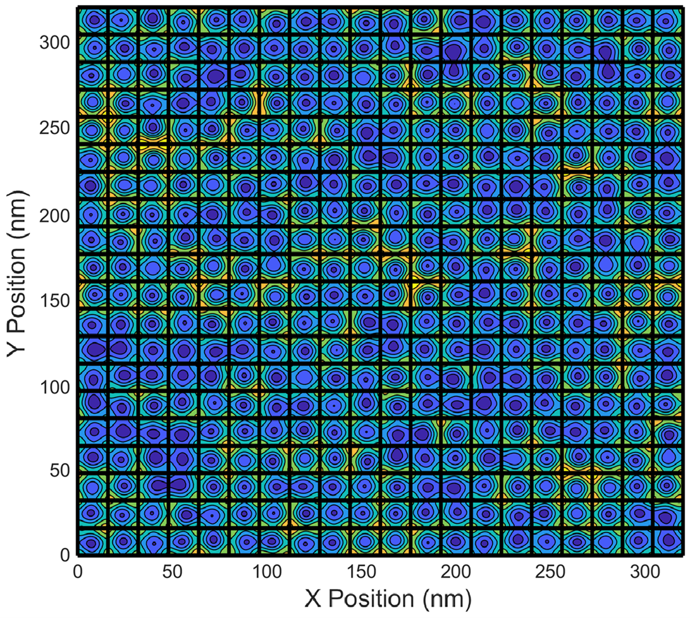
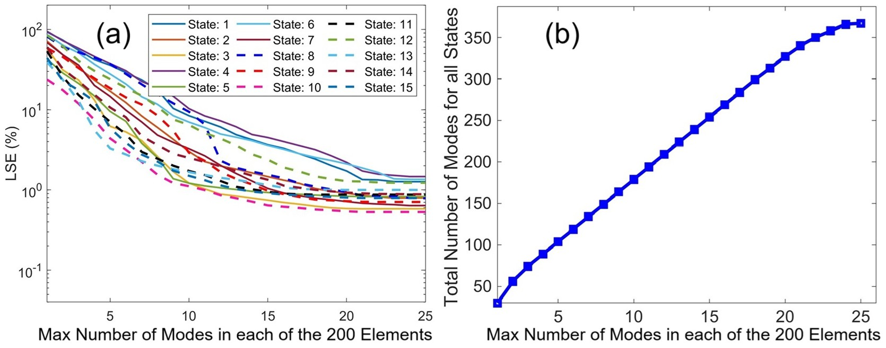

# Physics-Aware POD-Based Learning for Ab initio QEM-Galerkin Simulations of Periodic Nanostructures
The code developed by Martin Veresko and Ming-Cheng Cheng uses the QEM-Galerkin Simulation method to compute the wavefunctions and energies for periodic crystal structures like that seen in Fig. 1 and accompanies the paper ????. 

<figure>
  
  <figcaption>Fig. 1: Contour of nanostructure potential with with 20 by 20 elements.</figcaption>
</figure>

## Instructions
Firstly, read the Input.txt file. This file contains details of what every imput signifies. Once you have changed the inputs to your liking you can run the training and verification stages all together with the script RunAll.m. If all is correct your QEM LSE plot should look like Fig. 2. 

<figure>
  
  
  <figcaption>Fig. 2: LSE of QSs 1-15, as a function of the maximum number of modes (Mel,m) in each of the 400 elements. (b) Total number of modes (or DoF) used for the first 15 states needed in post processing.</figcaption> 
</figure>
 

Run DNSCOMPARE.m and then QEMrunner.m if you want to generate a new verification nanostructure inaddition to generating the QEM results.
  

Finally, if you only want to verify the model again without retraining with a previously ran verification nanostrcuture, you simply should run QEMrunner.m. This allows you to change QEM parameters to optimize the LSE.

